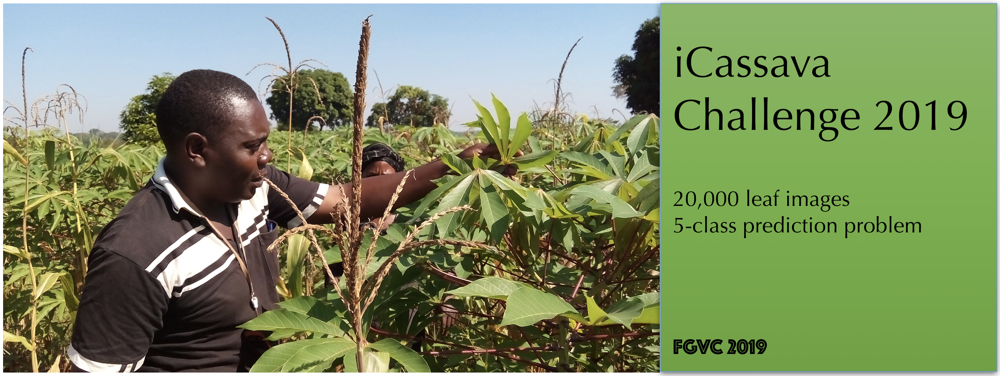

# FGVCx Cassava disease diagnosis

This is a new Fine Grained Visual Categorization-x (FGVCx) challenge for 2019 that will run as part of the [FGVC6 workshop](http://fgvc.org) at [CVPR](http://cvpr2019.thecvf.com/)

## The Challenge
The goal of this task is to build a robust model that is able to distinguish between diseases in a particular crop important for Africa called Cassava from images of the leaves taken of 4 different diseases at different levels of severity.

One task with this dataset is to attempt a 5 class classification problem where you are attempting to distinguish between the 5 broad types of diseases; Cassava Mosaic Disease (CMD), Cassava Green Mite disease (CGM), Cassava Bacterial Blight (CBB), Cassava Brown Streak Disease (CBSD) and the health class (Figure above). In short, given a cassava leaf image can you predict the disease incidence.

The other task would be to build a model that simultaneously predicts the disease incidence and severity. The data is labelled with the disease incidence and for each disease, the different types of example images of 5 types of incidence scored 1-5; 1 being the class of a healthy leaf image, 5 being the class of a severly infected cassava plant as shown in the figure above.

## Kaggle
For this challenge, we are using Kaggle to host the data and the leaderboard. Checkout the competition page here.

## Dates (TBD)
|||
|----|---------------|
Data Released| |
Submission Server Open | |
Submission Deadline|  |
Winners Announced| |

## Data
The data will consist of leaf images in each class. An abstracted reduced dataset of the images can be [downloaded here](pdata.zip).

